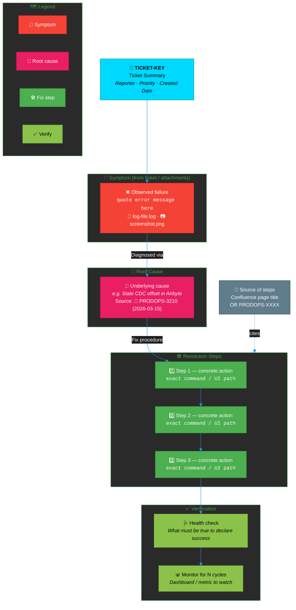
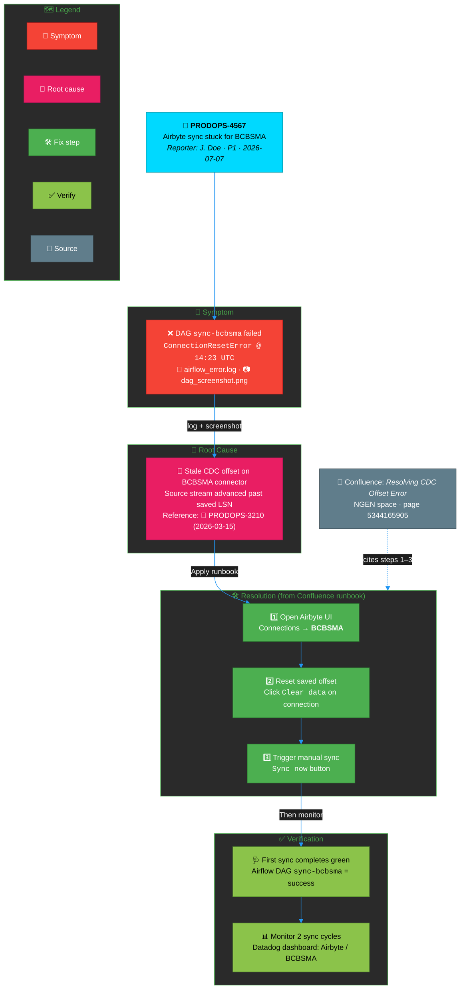
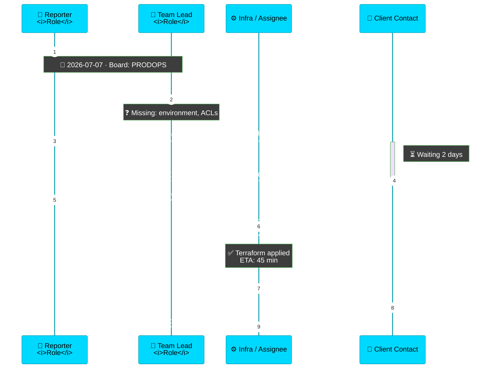
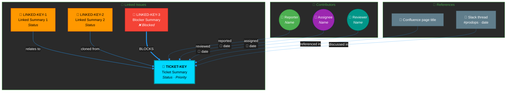
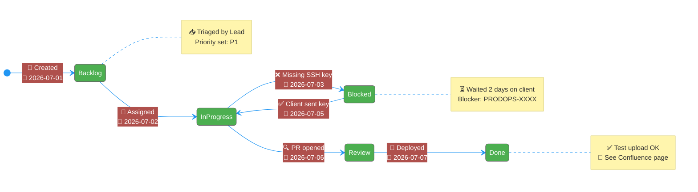
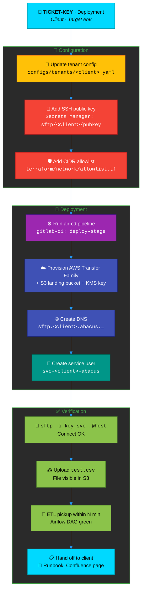
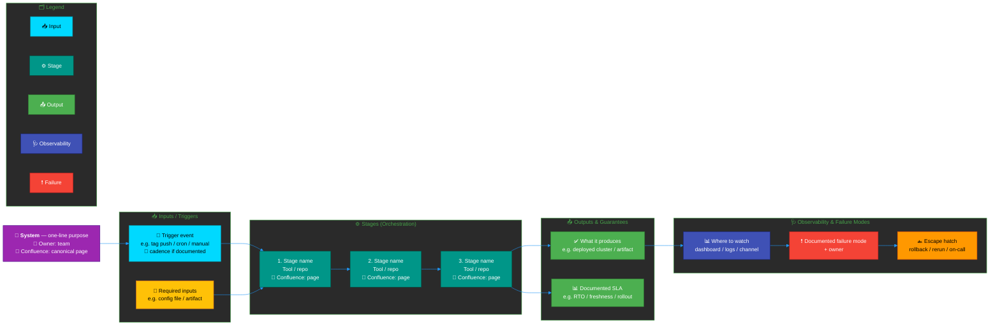

# Professional Mermaid Diagram Templates for ProdOps Bot

High-density, information-rich Mermaid diagram templates. The goal is that a
person who opens the diagram in Slack can **understand the ticket without
reading the analysis text**. Diagrams must be descriptive, cite evidence, and
show cause → action → verification — not just abstract boxes.

> **Golden rule:** Always derive diagram content from the **target ticket's**
> Jira data (description, comments, changelog, linked issues, attachments).
> Never copy content from another ticket. Never invent facts.

---

## 1. Content Requirements (Mandatory Quality Bar)

Every diagram you produce MUST satisfy the following. Diagrams that fail these
checks are considered low quality and should not be posted.

### 1.1 Minimum information density

| Element                         | Minimum requirement |
|---------------------------------|---------------------|
| Nodes                           | ≥ 8 meaningful nodes (excluding legend). More if the ticket warrants. |
| Multi-line labels               | ≥ 60% of nodes use `<br/>` to show at least 2 pieces of info (title + context/evidence/timestamp). |
| Source citations                | ≥ 1 node references a real source: `PRODOPS-XXXX`, Confluence page name, or Slack channel. |
| Timeline anchors                | ≥ 1 timestamp/date drawn from the ticket (created, comment date, status change). |
| Evidence quotes                 | ≥ 1 node includes a short (≤ 60 char) quote from a log, error message, comment, or attachment. Use `<code>…</code>` or backticks. |
| Verification step               | ≥ 1 node showing how success is validated (health check, sync cycle, test upload, etc.). |
| Root cause / trigger            | ≥ 1 node explicitly labeled as the cause (error class, missing config, blocked dependency). |
| Emoji icons                     | Every node has an emoji from the Icon Reference (§6). |
| Inline styles                   | Every node has a `style` line with border + fill + text color. |
| Edge labels                     | ≥ 80% of edges labeled with the action, protocol, or relationship. |
| Legend                          | Every diagram ends with a `Legend` subgraph mapping ≥ 3 colors → meanings. |

### 1.2 Structural requirements

Every diagram MUST contain five semantic zones — but the zone set depends on
intent (see `prodops-workflow-gate` Step 0.5).

#### For `ticket_op` diagrams (Templates 1–6):

1. **Context** — Who reported, when, which client, which service.
2. **Trigger / Symptom** — What went wrong; quote the error or symptom.
3. **Root Cause** — What caused it (from past tickets, comments, or attachment logs).
4. **Resolution Steps** — Numbered, concrete actions. Include the actual
   command, config path, UI navigation, or ticket to file — not "execute fix".
5. **Verification** — How the assignee confirms the fix worked.

#### For `knowledge_query` diagrams (Template 7 — system/workflow explainer):

Ticket zones do not apply (there is no ticket, no symptom, no root cause).
The five required zones are:

1. **Purpose & Owner** — What this system/workflow does in one line, owning team,
   canonical Confluence page.
2. **Inputs / Triggers** — What starts it (event, cron, human action, upstream
   artifact). Include cadence or schedule if documented.
3. **Stages / Orchestration** — Sequential (or parallel) steps. Each stage names
   the actual tool/service/repo/artifact — not a verb like "process".
4. **Outputs & Guarantees** — What it produces (artifact, table, deployment
   state) and its documented SLA/consistency guarantee, if any.
5. **Observability & Failure Modes** — Where you watch it (dashboard, logs,
   Slack channel), documented common failure(s), and the documented escape hatch
   (rollback, manual re-run, on-call rotation).

Every stage node MUST carry a per-claim source (Confluence page name or
`PRODOPS-XXXX`). Unsourced stages must be omitted or marked `⚠️ unverified` —
the same discipline as the `knowledge_query` text answer
(see `000-guardrails.mdc`). Never invent commands, filenames, or paths.

### 1.3 Label quality rules

- **Never** use vague labels like "Execute Resolution", "Do the thing",
  "Process data", or "Handle request". Replace with the concrete action:
  `Clear CDC offset<br/>Airbyte UI → Connections<br/>→ BCBSMA → Clear Data`.
- **Always** include the artifact: filename, command, ticket key, page title,
  API endpoint, dashboard name. Example:
  `Restart connector<br/><code>kubectl rollout restart<br/>deploy/airbyte-worker</code>`.
- **Always** attribute steps to their source:
  `📖 Confluence: Resolving CDC Offset Error` or
  `🎫 PRODOPS-3210 — resolved 2026-03-15`.

### 1.4 Rendering rules

- Keep the `%%{init:}%%` block on every diagram (dark theme).
- Keep node labels ≤ 4 lines of `<br/>`.
- Keep the diagram ≤ 25 nodes to stay readable in Slack thumbnails.
- Prefer `flowchart TD` (top-down) for resolutions, `flowchart LR` for
  data flows, `sequenceDiagram` for communication, `stateDiagram-v2` for
  lifecycles.

---

## 2. Color Palette

### Component-type colors

| Purpose                                | Fill      | Stroke    | Text color |
|----------------------------------------|-----------|-----------|-----------|
| External systems / clients             | `#00D9FF` | `#0097A7` | `#000`    |
| Routing / gateways / load balancers    | `#FF9800` | `#E65100` | `#000`    |
| Internal services / actions            | `#4CAF50` | `#2E7D32` | `#fff`    |
| Databases / storage                    | `#9C27B0` | `#4A148C` | `#fff`    |
| File systems / buckets                 | `#FFC107` | `#F57F17` | `#000`    |
| Data processing / ETL / pipelines      | `#009688` | `#004D40` | `#fff`    |
| Networking / SFTP / VPN                | `#3F51B5` | `#1A237E` | `#fff`    |
| Security / IAM / auth                  | `#F44336` | `#B71C1C` | `#fff`    |
| Decision points / blockers / root cause| `#E91E63` | `#AD1457` | `#fff`    |
| Evidence / logs / attachments          | `#607D8B` | `#37474F` | `#fff`    |
| Verification / validation / checks     | `#8BC34A` | `#558B2F` | `#000`    |

### Status colors

| State           | Fill      | Text color |
|-----------------|-----------|-----------|
| Done / success  | `#4CAF50` | `#fff`    |
| In progress     | `#2196F3` | `#fff`    |
| Blocked / closed| `#F44336` | `#fff`    |
| Waiting / pending| `#FF9800`| `#000`    |

---

## 3. Standard init header

Copy this block to the top of every non-sequence diagram:

```
%%{init: {'theme':'base', 'themeVariables': {
  'primaryColor':'#4CAF50',
  'primaryTextColor':'#ffffff',
  'primaryBorderColor':'#2E7D32',
  'lineColor':'#2196F3',
  'secondaryColor':'#FF9800',
  'tertiaryColor':'#9C27B0',
  'background':'#1E1E1E',
  'mainBkgColor':'#2D2D2D',
  'textColor':'#FFFFFF',
  'edgeLabelBackground':'#1E1E1E',
  'clusterBkg':'#2A2A2A',
  'clusterBorder':'#4CAF50',
  'defaultLinkColor':'#90CAF9',
  'titleColor':'#FFFFFF',
  'tertiaryBorderColor':'#7B1FA2',
  'fontSize':'14px',
  'fontFamily':'Inter, "Segoe UI", Roboto, sans-serif'
}}}%%
```

---

## 4. Templates

Each template below shows (a) the structural skeleton and (b) a **worked
example** filled in with realistic ticket data. When generating a diagram,
copy the skeleton, then replace placeholders using data from the actual
target ticket — **not the example data**.

---

### Template 1 — Ticket Resolution Flow  (`flowchart TD`)

Use when explaining how a ticket was (or should be) resolved.
Must include: Context → Symptom → Root Cause → Numbered Steps → Verification.

#### 1a. Skeleton



#### 1b. Worked example (PRODOPS-4567 — Airbyte BCBSMA sync stuck)



---

### Template 2 — Infrastructure / Data Flow  (`flowchart LR`)

Use for pipelines, SFTP flows, ingestion architecture. Must show:
Source system → transport/security → landing → processing → storage → output,
with **data volume / cadence** and **failure point** annotated where relevant.

#### 2a. Skeleton

```mermaid
%%{init: {'theme':'base', 'themeVariables': {
  'primaryColor':'#4CAF50','primaryTextColor':'#ffffff','lineColor':'#2196F3',
  'background':'#1E1E1E','mainBkgColor':'#2D2D2D','textColor':'#FFFFFF',
  'edgeLabelBackground':'#1E1E1E','clusterBkg':'#2A2A2A','clusterBorder':'#4CAF50',
  'defaultLinkColor':'#90CAF9','fontSize':'14px'
}}}%%
flowchart LR
    TITLE["🎫 <b>TICKET-KEY</b> · Data flow<br/><i>Client · Environment · Cadence</i>"]

    subgraph Client["🏥 Client Environment"]
        SRC["💾 Source System<br/><i>e.g. Facets EDW · Oracle 19c</i><br/>Cadence: <b>daily @ 02:00 UTC</b>"]
    end

    subgraph Transport["🔒 Secure Transport"]
        PROTO["🔌 Transport<br/><i>SFTP / HTTPS / AWS Transfer Family</i><br/>Auth: SSH key · IP allowlist"]
        AUTH["🔑 Auth<br/><i>User: svc-client-abacus</i>"]
        FW["🛡️ Firewall / VPC<br/>CIDR allowlist"]
    end

    subgraph Platform["☁️ Abacus NextGen (PHI VPC)"]
        LAND["📥 Landing S3<br/><code>s3://landing/client/…</code>"]
        DEC["🔓 Landing-decrypt<br/>KMS + PGP"]
        ETL["🔄 Airbyte / dbt<br/>Pipeline: <b>client-etl</b>"]
        WH[("🗄️ Snowflake<br/><b>PROD_CURATED</b>")]
        API["📊 API / Reports<br/>Domain model exposure"]
    end

    FAIL{{"❗ Failure point<br/>Where the ticket says it broke"}}

    SRC -->|"push files"| PROTO
    AUTH -.->|"authenticates"| PROTO
    FW -.->|"allows"| PROTO
    PROTO -->|"lands"| LAND
    LAND -->|"decrypts"| DEC
    DEC -->|"ELT"| ETL
    ETL -->|"upserts"| WH
    WH -->|"serves"| API
    FAIL -.->|"observed at"| ETL

    TITLE --> Client

    subgraph Legend["🗺️ Legend"]
        L1["🏥 External"]:::ext
        L2["🔒 Transport / Security"]:::sec
        L3["🔄 Processing"]:::proc
        L4["🗄️ Storage"]:::stor
        L5["❗ Failure point"]:::fail
    end
    classDef ext fill:#00D9FF,stroke:#0097A7,color:#000
    classDef sec fill:#3F51B5,stroke:#1A237E,color:#fff
    classDef proc fill:#009688,stroke:#004D40,color:#fff
    classDef stor fill:#9C27B0,stroke:#4A148C,color:#fff
    classDef fail fill:#E91E63,stroke:#AD1457,color:#fff

    style TITLE fill:#00D9FF,stroke:#0097A7,color:#000
    style SRC fill:#00D9FF,stroke:#0097A7,color:#000
    style PROTO fill:#3F51B5,stroke:#1A237E,color:#fff
    style AUTH fill:#F44336,stroke:#B71C1C,color:#fff
    style FW fill:#F44336,stroke:#B71C1C,color:#fff
    style LAND fill:#FFC107,stroke:#F57F17,color:#000
    style DEC fill:#F44336,stroke:#B71C1C,color:#fff
    style ETL fill:#009688,stroke:#004D40,color:#fff
    style WH fill:#9C27B0,stroke:#4A148C,color:#fff
    style API fill:#4CAF50,stroke:#2E7D32,color:#fff
    style FAIL fill:#E91E63,stroke:#AD1457,color:#fff
```



---

### Template 3 — Communication Sequence  (`sequenceDiagram`)

Use for who-did-what-when narratives (ticket comment history).
Must include: actor titles, dates on notes, quoted actions (not "did stuff"),
and any outstanding wait states.

#### 3a. Skeleton



---

### Template 4 — Ticket Relationship Map  (`graph TB`)

Use when the ticket has linked issues, dependencies, or multiple contributors.
Must include: ticket key + summary on each node, link type on every edge,
and role on each contributor.

#### 4a. Skeleton



---

### Template 5 — Status Lifecycle  (`stateDiagram-v2`)

Use for status transitions from the changelog. Must include: dates on
transitions, and a note on each state explaining what happened there.

#### 5a. Skeleton



---

### Template 6 — Deployment Pipeline  (`flowchart TD`)

Use for provisioning / config-change / deployment tickets. Must include:
config file paths, exact tool names, and a distinct verification zone.

#### 6a. Skeleton



---

### Template 7 — System / Workflow Explainer  (`flowchart LR`) — fallback only

> **Preferred pipeline for `knowledge_query` diagrams is
> `scripts/diagram_render/templates/knowledge_answer.html.j2`** — a Jinja2 +
> Playwright infographic card that produces a polished, information-dense
> answer without the readability problems of a boxes-and-arrows Mermaid graph
> for a knowledge answer. See `scripts/diagram_render/README.md`.
>
> Use this Mermaid template only when the answer genuinely needs a
> boxes-and-arrows workflow flow that the HTML card cannot express, and the
> Playwright renderer is unavailable.

Use for "explain how X works" questions where X is a system, pipeline, workflow,
release process, or architecture (e.g. "explain the Seiji Deploy workflow",
"how does AIR CD deploy?", "walk me through the Airbyte sync pipeline").

**Rendering choices (why this differs from Templates 1–6):**

- `flowchart LR` (left-to-right), not `TD`. A workflow reads naturally as a
  pipeline; TD makes Slack render a tall, skinny, unreadable column.
- Five subgraphs arranged **left-to-right**: Purpose → Inputs → Stages →
  Outputs → Observability. Never a stack of narrow vertical subgraphs.
- Legend at the **bottom**, not as a floating side column.
- Max ~ 15 nodes total (fewer than Templates 1–6). Slack thumbnails need air.
- Every stage node cites a Confluence page / ticket / channel by name.
  Unsourced stage → omit or mark `⚠️ unverified`.
- Labels ≤ 3 lines of `<br/>`. Keep each line ≤ ~ 32 chars so nothing gets
  cropped in a Slack thumbnail.

#### 7a. Skeleton



#### 7b. How to fill this in (mandatory discipline)

The skeleton above is a shape, not content. To produce the actual diagram for
a `knowledge_query` (e.g. "explain the Seiji Deploy workflow"):

1. First run the `knowledge_query` K1–K2 search (workflow-gate + knowledge-expansion):
   locate the canonical Confluence page for the system, plus at least one
   corroborating source (release announcement, Slack pin, related PRODOPS ticket).
2. Extract, from those first-hand sources ONLY:
   - the one-line purpose and owning team → `TITLE`;
   - the actual trigger(s) and cadence → `Inputs`;
   - the real orchestration stages, in order, with the real tool/repo/service
     names → `Stages`. **Do not paraphrase into generic verbs.** If a stage's
     name/tool cannot be sourced, omit that stage.
   - the documented outputs and any SLA/guarantee text → `Outputs`;
   - the documented dashboard/log/Slack-channel, common failure modes, and
     rollback procedure → `Observability`.
3. Attach a per-stage source citation (Confluence page title, `PRODOPS-XXXX`,
   or `#channel`) inside each stage node. Mirrors the text answer's per-claim
   attribution rule.
4. If a subgraph would have < 1 sourced node → remove that subgraph and note
   the gap in the text answer instead of inventing content.
5. Confidence for the diagram inherits from the K3 judge scorecard — a
   single-source diagram caps at Medium and must say so in the text answer.

#### 7c. Anti-patterns specific to this template

- ❌ Using `flowchart TD` — produces the tall, narrow, unreadable layout.
- ❌ Legend as a floating vertical column at the far left/right. Put it at the
  bottom as a horizontal subgraph.
- ❌ Reusing the `ticket_op` zones (Symptom / Root Cause / Verification) for a
  workflow explanation. There is no ticket, no symptom, no root cause.
- ❌ Filling stages with paraphrased verbs ("Merge to release branches",
  "Update default") when the source page has a concrete tool name. Use the
  concrete tool.
- ❌ Node labels that get cropped in Slack: keep each `<br/>` line ≤ ~ 32 chars.
- ❌ Inventing commands, filenames, dates, or repo paths to satisfy the ≥ 8
  node minimum. If the sourced material only supports 6 nodes, post 6 nodes
  and lower the diagram's confidence.

---

## 5. Usage Guidelines

1. Always include the `%%{init:}%%` directive at the top of every diagram.
2. Every node must have an emoji from the Icon Reference (§6).
3. Every node must have an inline `style` line — no default colors.
4. Every diagram must satisfy the **Content Requirements** in §1.
5. Prefer 4-line multi-info labels (title + evidence + timestamp + source)
   over single-line generic labels.
6. Every edge must be labeled unless the flow is trivially linear.
7. Every diagram must include a `Legend` subgraph or clearly color-coded zones.
8. Never reuse another ticket's content. Always derive from the target ticket.
9. Never fabricate ticket keys, Confluence URLs, filenames, or commands.
   If unknown → omit the node rather than inventing.
10. Test-render the Mermaid before uploading to Slack. Broken diagrams are
    worse than no diagram.

---

## 6. Icon Reference

| Icon | Meaning |
|------|---------|
| 🎫 | Ticket / issue / work item |
| 🏥 | External system (client, vendor, partner) |
| 🌐 | API gateway / load balancer / DNS |
| ⚙️ | Application service / deployment tool |
| 🗄️ | Database (Snowflake, RDS, Postgres) |
| 💾 | Storage (S3, SFTP landing, file system) |
| 🔄 | Data processing / ETL / pipeline |
| 🔒 | Security / IAM / auth |
| 🔑 | SSH key / credential / secret |
| 🛡️ | Firewall / allowlist / security group |
| 🔀 | Routing / decision / triage |
| ✅ | Success / resolved / verified |
| ❌ | Blocked / failed / closed |
| ⏳ | Waiting / pending / on hold |
| ❗ | Failure point / incident marker |
| 🎯 | Root cause |
| 🚨 | Symptom / observed error |
| 🩺 | Health check / diagnostic |
| 📋 | Prerequisite / checklist |
| 📤 | Outbound (sent, uploaded) |
| 📥 | Inbound (received, landed) |
| 📊 | Monitoring / analytics / dashboard |
| 🔌 | Networking / VPC / connectivity |
| 📅 | Date / timestamp / milestone |
| 📁 | File / folder / config |
| 📝 | Template / transformation / config file |
| 📎 | Attachment (log, CSV, etc.) |
| 📷 | Screenshot |
| 👤 | Person / user / assignee |
| 👥 | Team / group |
| 🔗 | Linked issue / dependency |
| 🚀 | Deploy / launch / go live |
| ☁️ | Cloud resource (AWS, GCP) |
| 📖 | Documentation / runbook / Confluence |
| 💬 | Slack / discussion thread |

---

## 7. Anti-patterns (do NOT do these)

- ❌ Nodes labeled "Do the thing", "Execute", "Process", "Handle". Use the
  concrete command/action/artifact.
- ❌ Skipping the symptom or root cause node in a resolution diagram.
- ❌ Diagrams under 8 nodes when the ticket has clear multi-step flow.
- ❌ Edges without labels in non-trivial flows.
- ❌ Placeholder text left in the final diagram (`TICKET-KEY`, `Person 1`).
- ❌ Fabricated ticket keys or Confluence URLs to fill a slot.
- ❌ Using markdown pipe tables inside a Mermaid node (Slack won't render them).
- ❌ Long paragraph labels — split with `<br/>`, cap at 4 lines.
