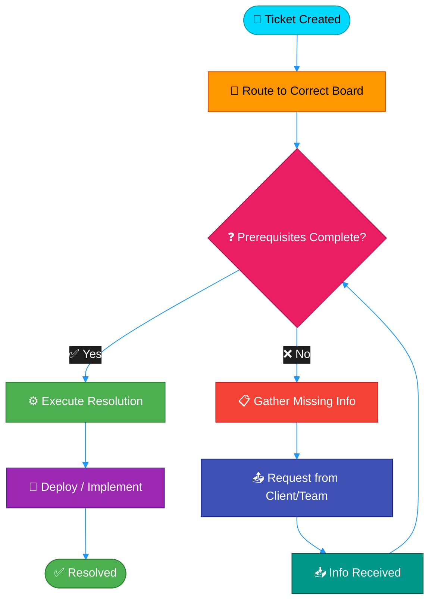
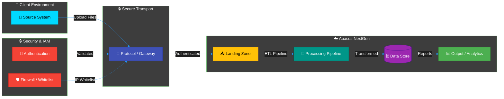
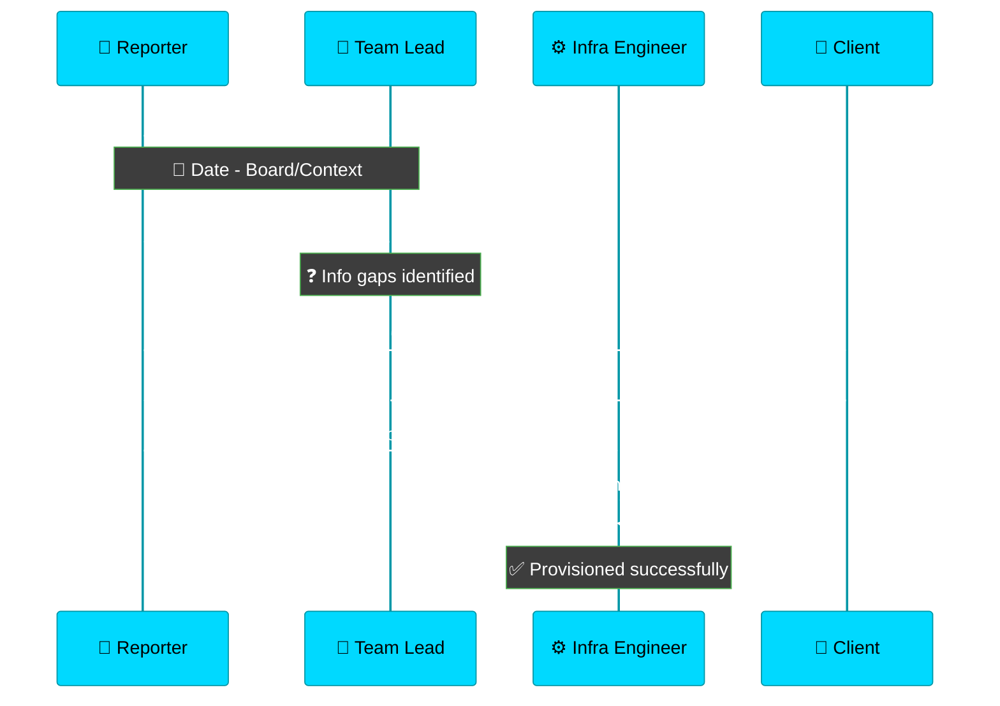
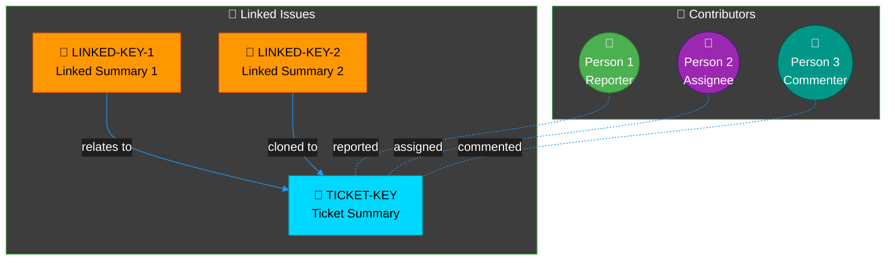
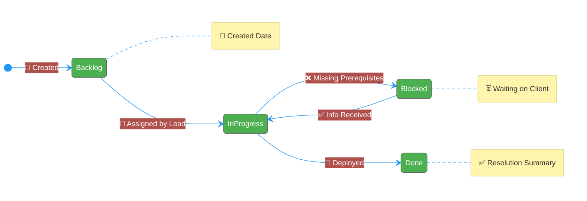
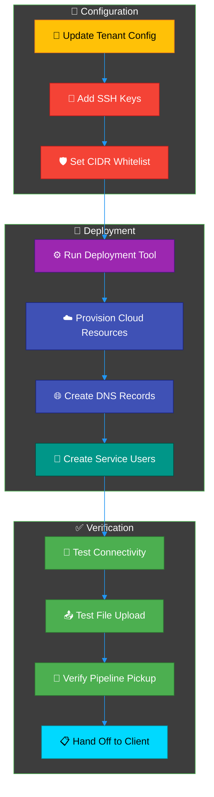
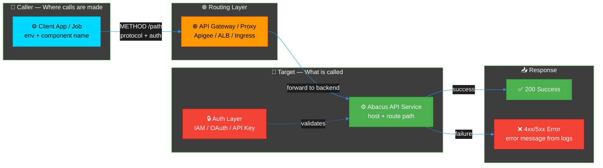

# Professional Mermaid Diagram Templates for ProdOps Bot

Generic structure and styling references for Mermaid diagrams. When explaining a ticket or process, **always** derive diagram content from **that ticket's** Jira data (description, comments, changelog, linked issues). Do **not** hardcode content from another ticket.

## Color Palette

### Component Type Colors
* **External Systems / Clients**: `#00D9FF` (Bright Cyan) - White text
* **Routing / Gateways / Load Balancers**: `#FF9800` (Bright Orange) - Dark text
* **Internal Services / Actions**: `#4CAF50` (Bright Green) - White text
* **Databases / Storage**: `#9C27B0` (Bright Purple) - White text
* **File Systems / Buckets**: `#FFC107` (Bright Yellow) - Dark text
* **Data Processing / ETL / Pipelines**: `#009688` (Bright Teal) - White text
* **Networking / SFTP / VPN**: `#3F51B5` (Bright Indigo) - White text
* **Security / IAM / Auth**: `#F44336` (Bright Red) - White text
* **Decision Points / Blockers**: `#E91E63` (Bright Pink) - White text
* **Status: Done / Success**: `#4CAF50` (Bright Green) - White text
* **Status: In Progress**: `#2196F3` (Bright Blue) - White text
* **Status: Blocked / Closed**: `#F44336` (Bright Red) - White text
* **Status: Waiting / Pending**: `#FF9800` (Bright Orange) - Dark text

---

## Template 1: Ticket Resolution Flow

Use the **target ticket's** actual resolution steps from comments/changelog. Placeholder structure only:

---

## Template 2: Infrastructure / Data Flow Architecture

Use the **target ticket's** infrastructure components from description/comments. Placeholder structure only:

---

## Template 3: Ticket Communication Sequence

Use the **target ticket's** actual commenters and actions from the comment history. Placeholder structure only:

---

## Template 4: Ticket Relationship Map

Use the **target ticket's** actual linked issues and contributors from Jira fields. Placeholder structure only:

---

## Template 5: Status Lifecycle

Use the **target ticket's** actual status transitions from the changelog. Placeholder structure only:

---

## Template 6: Deployment Pipeline

Use the **target ticket's** actual deployment steps from description/comments. Placeholder structure only:

---

## Template 7: API & Integrations Call Flow

**Use when** the ticket involves API errors, integration failures, webhooks, OAuth, FHIR APIs, or external service calls.

**Mandatory rule:** Every API/integration diagram MUST show **where calls originate** (caller component + environment) and **what they target** (full endpoint URL or service path, HTTP method, auth type). Edge labels must include method + path (e.g. `POST /api/event/nasco`).

Derive all nodes and edges from the **target ticket's** description, comments, and logs. Placeholder structure only:

### API & Integrations — Required Edge Labels

| Edge | Must include |
|------|--------------|
| Caller → Gateway | HTTP method, path, protocol (HTTPS), auth type (SigV4, OAuth, API key) |
| Gateway → Target | Backend host or service name, forwarded path |
| Target → Response | Status code (200, 403, 500) and error class from ticket logs |

### API & Integrations — Data Sources (priority order)

1. Ticket description — URLs, endpoints, error codes
2. Comments — API gateway logs, request/response samples
3. Attachments — log files with HTTP traces, screenshots of API consoles
4. Confluence design docs — only if linked in ticket or service config

**Do NOT** draw a generic "API box" without naming the caller, endpoint, and method.

---

## Usage Guidelines

1. **Always include the** `%%{init:}%%` directive at the start of every diagram
2. **Use emoji icons** consistently for component types (see Icon Reference below)
3. **Apply inline `style` rules** for consistent coloring on every node
4. **Use bright, high-contrast colors** that work on dark backgrounds
5. **Label all connections** with action/protocol/relationship info
6. **Use subgraphs** to organize components by zone/layer/phase
7. **Keep node labels short** — under 40 characters; use ` ` for line breaks
8. **Remove unused placeholder nodes** — only include what the ticket data supports
9. **Add more nodes** if the ticket has more steps/people/issues — copy the pattern
10. **Never reuse another ticket's diagram content** — derive nodes and edges from the ticket being explained
11. **API & Integrations tickets** — use Template 7; every call arrow must show caller → endpoint with method, path, and auth; include error responses from logs when present

---

## Icon Reference

* 🎫 Tickets / Issues / Work Items
* 🏥 External Systems (Clients, Vendors, Partners)
* 🌐 API Gateway / Load Balancer / DNS
* ⚙️ Application Services / Deployment Tools
* 🗄️ Databases (RDS, Postgres, etc.)
* 💾 Storage (S3, SFTP Landing, File Systems)
* 🔄 Data Processing / ETL / Pipelines
* 🔒 Security / IAM / Authentication
* 🔑 SSH Keys / Credentials / Secrets
* 🛡️ Firewall / Whitelist / Security Groups
* 🔀 Routing / Decision Points / Triage
* ✅ Success / Resolved / Completed
* ❌ Blocked / Failed / Closed / Error
* ⏳ Waiting / Pending / On Hold
* 📋 Prerequisites / Checklists / Requirements
* 📤 Outbound (Request sent, File uploaded)
* 📥 Inbound (Response received, File landed)
* 📊 Monitoring / Analytics / Reports
* 🔌 Networking / VPC / Connectivity
* 📅 Date / Time Operations / Milestones
* 📁 File / Folder / Config Operations
* 📝 Template / Transformation / Config Files
* 👤 Person / User / Assignee
* 👥 Team / Group / Contributors
* 🔗 Linked Issue / Dependency
* 🚀 Deploy / Launch / Go Live
* ☁️ Cloud Resources (AWS, Transfer Family, S3)